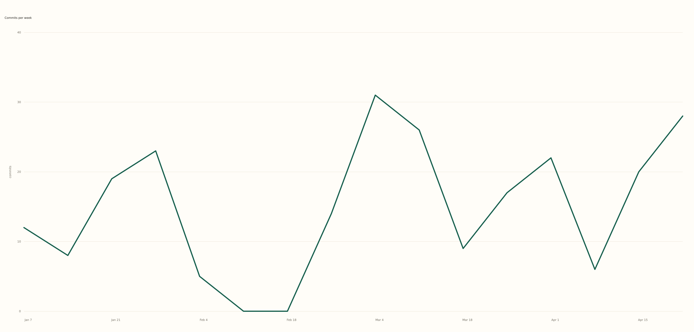

# chartsnap

Turn a CSV into a chart you can post, without uploading it anywhere.

Drop a file, chartsnap guesses a chart from your columns, and you download a PNG or SVG
sized for Twitter, Instagram, or an A4 page. It all runs in the browser, so your data
never touches a server.

**Live:** https://kbwen.github.io/chartsnap/



## Why it exists

You've got a small spreadsheet and want one good-looking chart for a post or a doc.
The usual options are all a bit annoying: Excel looks like Excel, Datawrapper and
Flourish want a login and put SVG behind a paywall, RAWGraphs makes you map every axis
by hand, and pasting company numbers into a chatbot means they've left your laptop.

chartsnap keeps it local and boring: drop, chart, download. It works offline, nothing
uploads, and the same CSV always gives you the same chart. SVG export is free.

## Try it

Open the [live version](https://kbwen.github.io/chartsnap/), or run it locally:

```bash
npm install
npm run dev
```

No CSV to hand? There are sample buttons on the page.

## How it picks a chart

It looks at what's in each column:

| Your data                    | Chart        |
| ---------------------------- | ------------ |
| a date or 4-digit year       | line         |
| text categories + numbers    | bar          |
| two or more number columns   | scatter      |
| a single number column       | bar, by row  |

Extra number columns become extra series. Guessed wrong? There's a line / bar / scatter
switch under the chart — the only setting, and that's on purpose.

Then pick a size and download. PNG and SVG both, free, no watermark.

- Twitter — 1200 × 675
- Instagram — 1080 × 1080
- A4 print — 3508 × 2480 (300 DPI)

## What it handles

Quoted commas, thousands separators, blank cells (drawn as gaps), big files (sampled
down with a note), and files that aren't UTF-8 (you get a "re-save as UTF-8" note
instead of garbled text).

## What it isn't

- Not a chart builder. No axis/field editor — if you need to wire things up by hand,
  [RAWGraphs](https://github.com/rawgraphs/rawgraphs-app) does that well.
- No dashboards, accounts, or saved state.
- Editable titles and labels aren't in yet.
- Numbers are read US-style (`1,234.56`); European `1.234,56` may come through as text.
- It charts rows as they are — it doesn't sum or group them.

## Under the hood

Vite and vanilla TypeScript, [Chart.js](https://www.chartjs.org/) for drawing,
[PapaParse](https://www.papaparse.com/) for the CSV, and
[canvas2svg](https://github.com/gliffy/canvas2svg) for the vector export. No backend;
it ships as static files to GitHub Pages.

`npm test` runs the column-detection cases plus an SVG smoke test — the tripwire that
fails loudly if the vector export ever breaks on a Chart.js update.

## License

MIT © [KbWen](https://github.com/KbWen)
